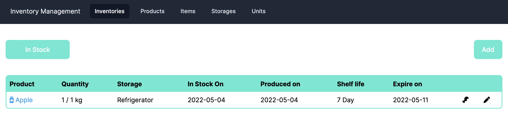
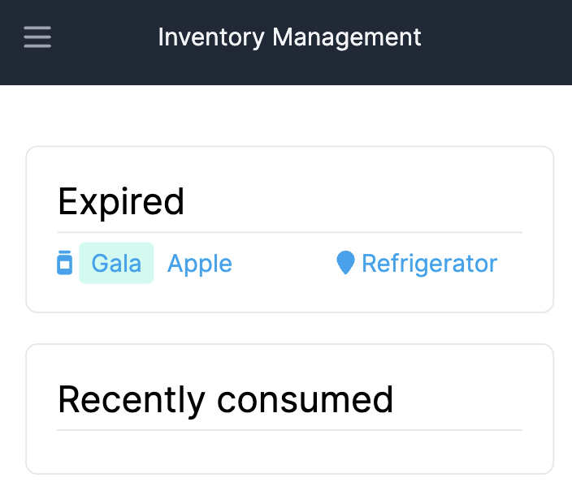
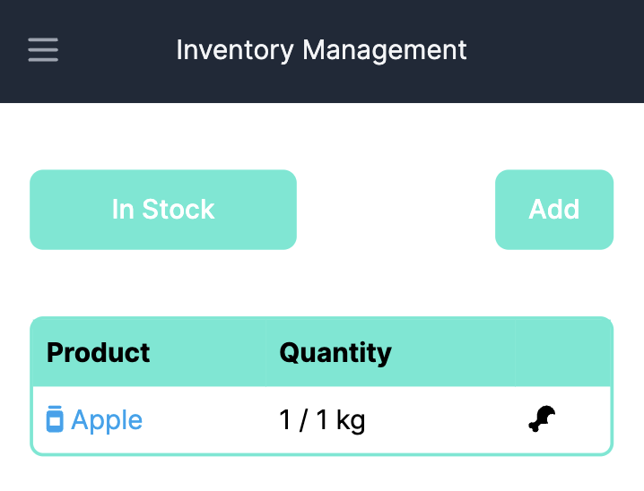
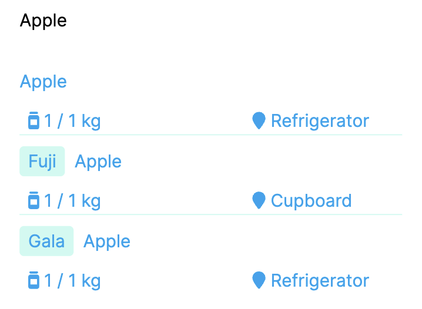
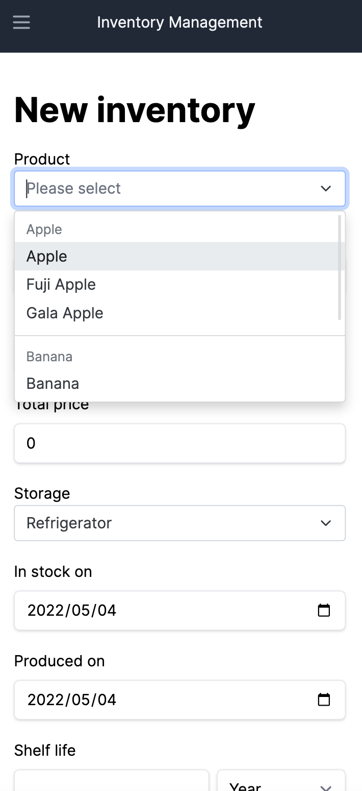

# Inventory Management

A mobile-friendly simple inventory management system for your home stock

## Features

- Manage products with variants
- Easily find out expired or out-of-stock products
- Consuming history management

## Requirement

- Ruby 2.7.5
- Rails 7

## Usage

### Run in development

```bash
rails db:migrate
bin/dev
```

### Run tests

```bash
RAILS_ENV=test rails assets:precompile
rails test
rails assets:clobber
```

## Screenshots











